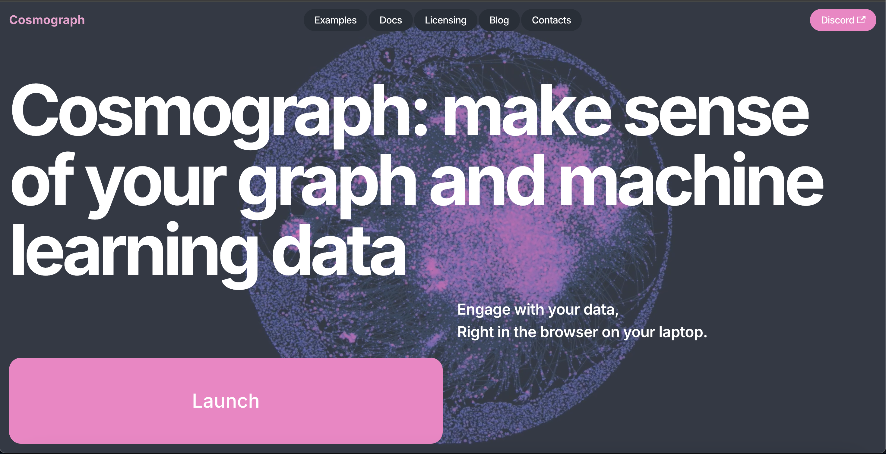
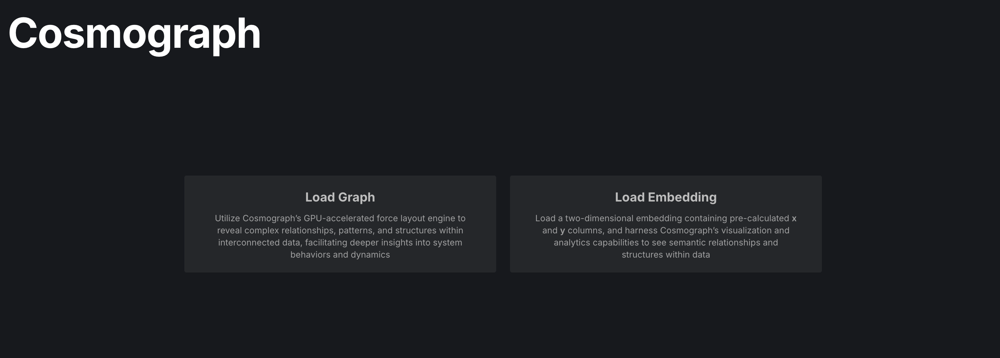
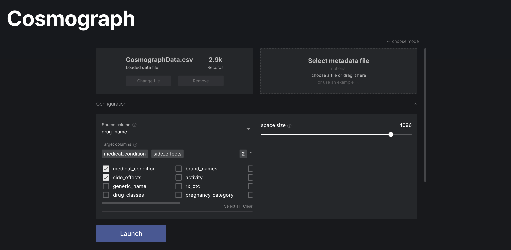
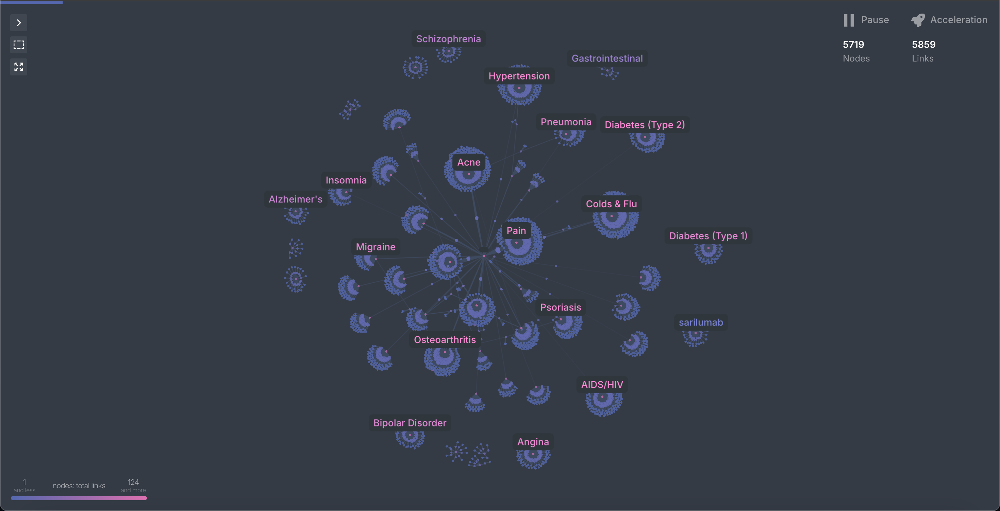
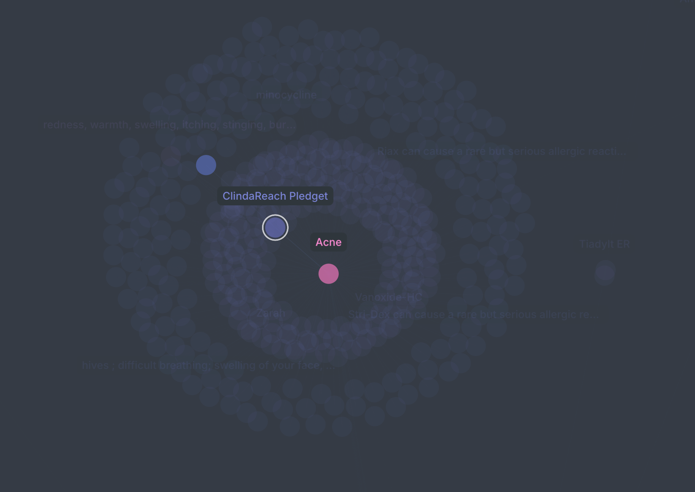

# COSC 421/521 Final Project

# Medical Analysis of Drugs and Side Effects using Network Science - Brief Summary

## 1. Problem Statement

### What problem did we solve?  
Patients and doctors around the world face challenges in understanding and optimizing the use of medications, particularly in terms of balancing efficacy and minimizing side effects. With nearly 50% of patients failing to adhere to their prescribed medications due to poor health literacy and limited access to actionable insights, the lack of effective and easy to understand tools to streamline this decision-making process is a critical issue.

### Why is this problem important?  
Non-adherence to medication significantly impacts public health, resulting in poor treatment outcomes. Addressing this gap can empower patients to make informed decisions and enable healthcare professionals to alter treatment plans that maximize benefits while minimizing harm, and taking into consideration patient preferences.

### Why is this novel?  
While existing research in network science and medicine focuses on understanding disease mechanisms and molecular networks, few tools offer insight by combining drugs, side effects, and patient preferences. Our approach integrates real human data with network-based analysis to provide recommendations.

---

## 2. Related Work

### What have others done to solve this (or a similar problem)?  
Previous studies have used network science to model disease interactions (e.g., the diseasome) and explore drug repurposing opportunities by analyzing shared molecular pathways. For example:  
- **Network Medicine**: Researchers like Barabási et al. used molecular networks to uncover comorbidities and shared genetic bases among diseases.  
- **Jaccard Coefficient Analysis**: Similarity metrics identified potential drug repurposing opportunities based on shared biological pathways.  

While these efforts advanced scientific understanding, they were not tailored for direct patient or practitioner use.

---

## 3. Our Approach

### How did we solve it?  
We leveraged network science to analyze relationships between drugs, diseases, and side effects. By constructing a graph-based model, we provided a tool for visualizing these relationships and ranking treatment options based on a weighted effectiveness score derived from user reviews.

### What data did we use, and where did it come from?  
We analyzed a dataset containing over 3,500 drugs, their associated diseases, and common side effects. The data was sourced from publicly available platforms such as Kaggle. We processed and merged multiple datasets to establish a comprehensive, structured resource for analysis.

---

## 4. Network Formation

### Describe the network(s) formed:  
- **Type of Network**: Bipartite graphs.  
- **Nodes**: Represent drugs and diseases (or side effects).  
- **Edges**: Indicate relationships such as:
  - A drug treating a specific disease.
  - A drug causing a specific side effect.

These graphs capture direct relationships and reveal hidden patterns, such as clusters of drugs with overlapping effects or conditions sharing similar treatment pathways.

---

## 5. Data Analysis

### What type of analysis did we carry out?  
We performed both structural and statistical analysis using network science methods:
- **Weighted Effectiveness Score**:  
`Score = User Rating × log(1 + Number of Reviews)`
- **Network Metrics Studied**:  
  - **Betweenness Centrality**: To identify critical drugs connecting multiple conditions.  
  - **Closeness Centrality**: To find drugs central to specific disease clusters.  
  - **Degree Distribution**: To identify frequently occurring side effects.  

---

## 6. Results

### What are your results?  
1. **Insights into Side Effects**:  
   - Fatigue and swelling were among the most common side effects linked to multiple drugs.  
2. **Drug Rankings**:  
   - Developed rankings of drugs based on effectiveness scores for 49 medical conditions.  
3. **Visualization**:  
   - Bipartite graphs showcasing disease-side effect relationships and highlighting top-performing drugs.  
4. **Statistics**:  
   - Average Weighted Effectiveness Score: 35.23.  
   - Correlation between activity and effectiveness score: 7.62%.  

---

## 7. Challenges and Fixes

### What went wrong, and how did you fix it?  
- **Issue**: Limited scope of side effects in the initial dataset.  
  **Fix**: Focused on the most common side effects to maintain a manageable scope and proposed expanding this in future iterations.  
- **Issue**: Sparse review data for certain drugs.  
  **Fix**: Weighted scores were adjusted to account for low review counts, ensuring fair representation.

---

## 8. Main Takeaways and Future Directions

### What is the main takeaway?  
Network science provides a powerful framework for visualizing and analyzing the complex interplay of drugs, diseases, and side effects. By focusing on user-centric metrics like effectiveness scores, we can bridge the gap in medication literacy and empower informed decision-making.

### If we were to carry out the project again, what would we do differently?  
- Expand the dataset to include more rare side effects and conditions.  
- Incorporate advanced machine learning techniques to predict drug effectiveness and side effect severity.  
- Conduct a more robust validation study to assess the tool’s impact in clinical settings.

---

## Contributors

- **Sami Jaffri**  
- **Ryan Eveson**  
- **Evan Pasenau**

University of British Columbia, Kelowna BC

---

# How to Use the Cosmograph Website

Follow the steps below to explore the graph visualization on the Cosmograph website.

## 1. Visit the Cosmograph App

Go to the following link and select Launch:

[Cosmograph App](https://cosmograph.app)

## 2. Click "Load Graph"

Once the page has loaded, click on the **"Load Graph"** button to begin the process.

## 3. Upload the Data File and Set Conditions
Select the **CosmographData.csv** file located in the `DataFiles/Cosmograph` folder of this repository. Upload it into the app.
In the app:
- Set the **Source** column to `drug_name`.
- Set the **Target** columns to `medical_condition` and `side_effects`.

Results should look similiar to the following image. 

## 4. Interact with the Graph

You can now interact with the graph:
- **Click on a pink node** to see the disease.
- The **middle layer** nodes represent the drugs.
- The **outer layer** nodes of the cluster represent the side effects.

---

